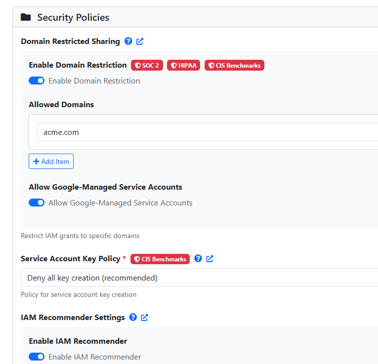
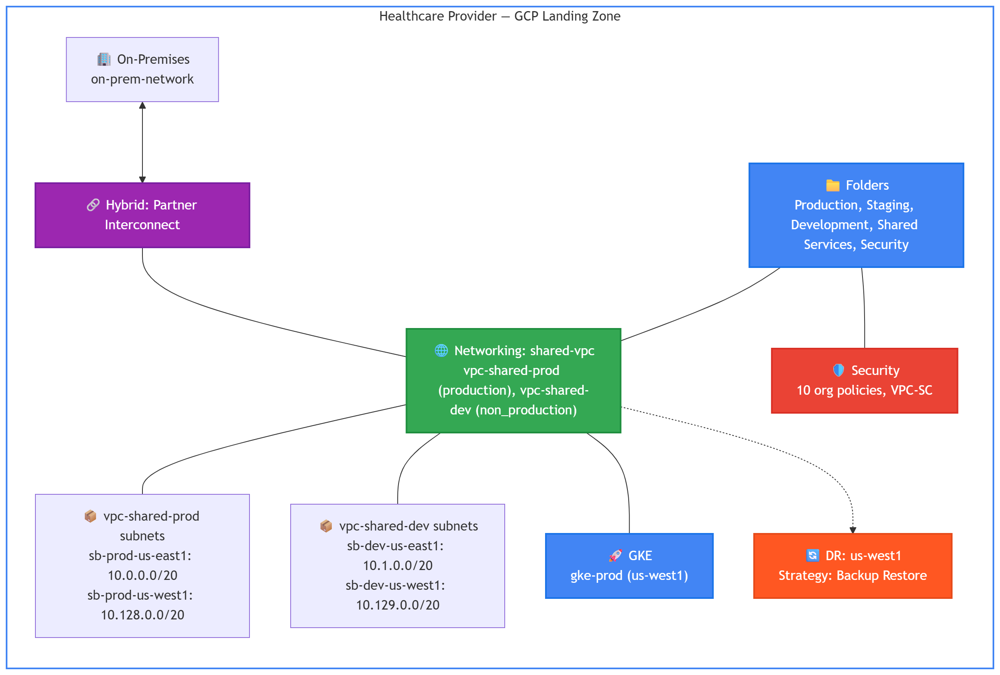
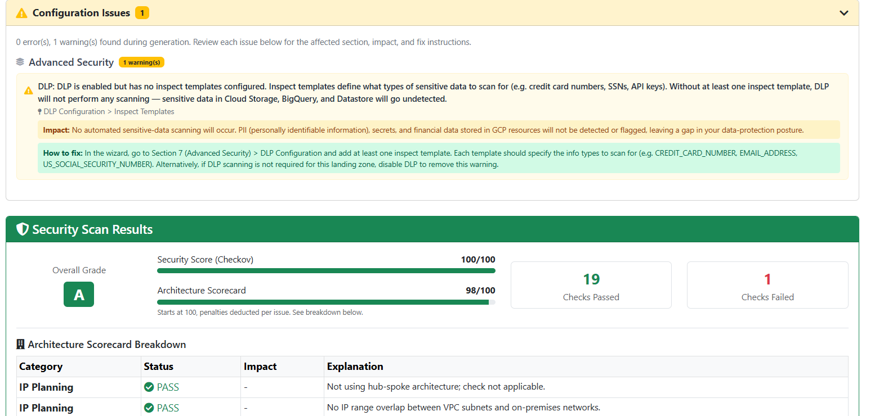

# HIPAA-Ready GCP Landing Zone Example

---

## The Problem

Your team knows how to build infrastructure on GCP. But when you're asked to build a landing zone for a US clinic, a different question appears: which of your GCP configuration decisions will matter at audit time, and which won't?

Google Cloud is covered under a Business Associate Agreement (BAA) — meaning Google's infrastructure is approved for handling patient data. That's the starting point, not the finish line. HIPAA still holds your organization responsible for how you configure access controls, audit logging, encryption, and breach detection on top of that infrastructure.

This repository shows a complete working example for a healthcare organization with SOC 2, HIPAA, and CIS requirements. Here's what's in it and how it was built.

---

## The Scenario

The organization in this example is a mid-size US healthcare provider — 201 to 500 employees, an engineering team of 21–50, with an existing GCP practice. They connect to on-premises systems via Partner Interconnect.

Their workload mix: GKE for containerized services, Cloud Run and Cloud Functions for APIs and event-driven workloads, Compute Engine for traditional systems, and Dataflow for data pipelines. Data services include BigQuery, Cloud SQL, Firestore, Cloud Storage, Pub/Sub, and Dataflow — all handling patient data.

Compliance requirements: HIPAA, SOC 2, and CIS. Encryption must be customer-managed. Target availability is 99.99% with a warm DR strategy — primary in us-east1, recovery in us-west1.

This is the Standard profile in Merlin — the tier for organizations with real compliance requirements and a team that knows what they're doing, but doesn't need the full enterprise governance stack.

---

## From Requirements to Configuration

Before any files are generated, Merlin runs the architect through a structured requirements wizard. For every field, Merlin already knows what HIPAA, SOC 2, and CIS require, and sets the default accordingly. The architect doesn't research which controls are mandatory — Merlin brings that knowledge to each decision, with compliance badges showing exactly which framework requires it and why.

Every confirmed decision is recorded in `spec.json` — the file sitting in this repository. That file is the complete requirements record: what was needed, what was decided, and what Merlin generated from it.

Three examples of how one field in spec.json becomes infrastructure:

**`compliance_requirements: [soc2, hipaa, cis]`** — This array drives the defaults throughout the wizard. It triggers 10 org policies at organization level, CMEK across all data services, VPC Service Controls perimeter, and audit log retention set to meet HIPAA's 6-year minimum requirement. A SOC 2-only profile would produce significantly fewer controls.

**`encryption_requirements: cmek`** — KMS key rings generated for both regions (us-east1 primary, us-west1 DR). CMEK enabled across BigQuery, Cloud SQL, Firestore, Cloud Storage, Pub/Sub, GKE Secrets, Compute Disks, and Dataflow — every service that touches patient data.

**`availability_target: 99.99`** — Higher than the government example. This single field influences the DR configuration, database replication settings, and GKE cluster setup. A clinic cannot afford extended downtime when patient care systems depend on the infrastructure.

The full `spec.json` is in the repository. Every decision in the rest of this article traces back to a field in that file.

---

## A Tour of the Repository Outputs

### Architecture Diagrams

Compare this to the government example. 5 folders instead of 8 — Production, Staging, Development, Shared Services, Security. No Sandbox, no Networking folder, no Data Platform folder, no team sub-folders. This is the Standard profile — the hierarchy is leaner because the governance requirements are narrower. HIPAA doesn't require the same degree of organizational separation that FedRAMP does.

The network architecture reflects the same logic — Shared VPC instead of hub-and-spoke. Two VPCs: vpc-shared-prod and vpc-shared-dev, each with subnets in us-east1 and us-west1. Simpler to operate, sufficient for the compliance requirements.

### Scorecards

Grade A, 96/100. Only 1 validation warning — the same CMEK auto-generation note as the government example. Zero cross-reference errors, zero broken network references. A cleaner output than the government example because the configuration is less complex.

### FAST YAML Files

68 files across 5 FAST stages — 14 fewer than the government example. The difference is mostly in org-setup (fewer folders, fewer org policies) and project-factory (3 environments instead of 4, no Sandbox projects).

Same deployment approach — review, replace placeholder values, copy into FAST stage directories, deploy in order.

### CMEK Wiring

Same principle as the government example — key rings are generated for both regions, but service agent bindings happen at workload deployment time. See [`CMEK_WIRING.md`](CMEK_WIRING.md) for the complete list.

---

## Try It Yourself

Everything in this repository was generated in a single Merlin session. The `spec.json`, the 68 FAST files, the scorecards, the CMEK wiring doc — one wizard run for a healthcare organization with three stacked compliance frameworks.

If your scenario is different — different compliance requirements, different workload mix, different connectivity — the output will be different. That's the point.

The repository is open. Clone it, study it, deploy it as a reference. Or run your own requirements through Merlin at [merlinstudio.cloud](https://site.merlin-studio.cloud) and get a design built for your specific situation.

---

*Part of the [Merlin Studio](https://site.merlin-studio.cloud) GCP Landing Zone example series.*  
*See also: [US Federal Agency Example](https://github.com/Merlin-Studio/US-Federal-Agency-Example) · Startup Example (coming soon)*
